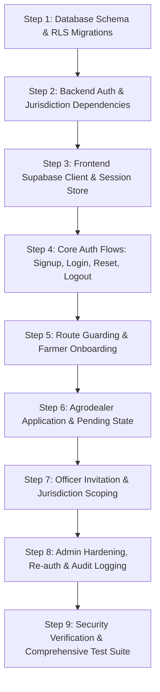

# SoilSync AI: Authentication & Authorization Implementation Plan

**Version:** 1.0 (MVP)  
**Architecture:** Supabase Auth (email + password), PostgreSQL Row Level Security (RLS), FastAPI Backend, React PWA  
**Status:** MVP mechanics implemented; database migrations 011–023 reconciled/applied on configured Supabase database; live journey verification remains  

---

## Executive Summary

This plan translates the **SoilSync AI Authentication & Authorization Logic (Version 1.0 MVP)** specification into a sequenced, verifiable development workflow. It establishes a single unified identity system across **Farmers, Extension Officers, Agrodealers, and Super Admins**, replacing legacy custom JWT/bcrypt and phone-OTP placeholders with Supabase Auth (email + password) and database-enforced Row Level Security (RLS).

## Completion Plan: Make the Auth System Authoritative

The screens and primary auth mechanics are present, but a feature is not considered ready until its identity, role state, and authorization decision agree across the browser, API, and database. Complete these phases in order:

1. **Fail-closed browser authorization — implemented.** A failed profile/role lookup no longer fabricates an active farmer role. Protected routes show a verification error with retry and sign-out actions, redirects wait for role hydration, and stale profile/role reads are discarded.
2. **Unify role and identity records — implemented in code and database.** `user_roles` is the authorization source for backend role checks, auth-link destination selection, and role-sensitive RLS policies. Role changes, approval, disablement, revocation, and dealer applications update Auth-UUID role rows; invited application-ID roles are transferred when the identity links. The missing configured-database migrations 011–014 were applied in dependency order; 015–017 were previously applied. Migrations 018–019 replaced legacy `users.role` checks in role-sensitive RLS policies with active-role helpers; live inspection found no remaining direct legacy-role policy predicates. Migration 020 enables and forces RLS on the legacy shared runtime-state table and removes client grants. The migration manager has reconciled local migrations 001–017 against declared live-schema objects and checksums, and records 018–020 as executed. This is not a claim about historical execution timestamps for 001–017. Five legacy app accounts remain unlinked and will be linked only on verified sign-in.
3. **Lock down the Supabase project configuration.** Email confirmation is disabled for the current testing rollout; signup should immediately create an authenticated session. Configure the Supabase invitation email template and Site URL/redirect allowlist to return invitees to the deployed app. Keep the password recovery redirect allowlist, SMTP, provider rate limits, and password policy configured. Keep the service-role key server-only. The configured SQL editor and migration connection run as `postgres`, but `public.spatial_ref_sys` is owned by `supabase_admin`; its underlying ACL still grants client privileges. Rather than changing the extension-owned object's grants, migrations 021–023 register `soilsync_meta.deny_spatial_ref_sys_api()` as the PostgREST pre-request hook. The hook rejects all requests to that endpoint with HTTP 404 while preserving other Data API routes. Anonymous GET verification returned 404 for `spatial_ref_sys` and 200 for the unrelated `users` endpoint. This control applies only to PostgREST Data API requests and does not hide API metadata or govern Realtime, Storage, or direct database connections.
4. **Admin-provisioned staff and dealer accounts — implemented in code; migration 024 must be applied.** Admins can invite officers with prefilled names and jurisdiction or agrodealers with an initial business profile. Supabase sends the secure invite email; no password or OTP is emailed. The assigned role remains pending until the recipient follows the invite link, chooses a password, and activates the invitation. Self-registered users continue to receive farmer access only. Officer farmer rosters continue to use the existing jurisdiction-based matching; this does not establish exclusive farmer ownership by one officer.
5. **Prove complete journeys against a non-production Supabase project.** Exercise new signup → confirmation → sign-in → profile onboarding; admin officer/dealer invite → email link → password setup → role activation; generic reset request → valid and expired/used recovery links → password update; active, pending, suspended, and revoked users; role changes; dealer approval; officer jurisdiction limits; admin re-authentication, inactivity timeout, and audit events. Verify both UI access and direct API denial for each prohibited state.
6. **Release gate and operations.** Apply migration 024 before using staff/dealer invitations. Run the full backend/frontend suites and production build, retain evidence of database/RLS checks and end-to-end results, confirm monitoring for auth-provider/database outages, then repeat the checks after deployment. Production readiness cannot be inferred from unit tests or from a checked implementation box alone.

The execution checklist below records implementation work. Items in Phase 2–5 above remain release gates until verified in the target Supabase environment.

---

## Work Breakdown Structure (Step-by-Step)

---

### Step 1: Database Schema, Triggers & Fail-Closed RLS Migrations
- **Objective:** Establish the single identity schema in PostgreSQL, remove legacy credential columns, and enforce fail-closed RLS on all tables.
- **Tasks:**
  1. Create SQL migration `backend/database/migrations/005_auth_authorization_v1.sql`:
     - `profiles`: `id` (`UUID REFERENCES auth.users(id) ON DELETE CASCADE PRIMARY KEY`), `full_name`, `county`, `sub_county`, `ward`, `phone_number` (validated `+254` format), `created_at`, `updated_at`. Ensure `password_hash` is completely eliminated.
     - `user_roles`: `id UUID PRIMARY KEY`, `user_id UUID REFERENCES auth.users(id)`, `role` (`'farmer' | 'extension-officer' | 'agrodealer' | 'admin'`), `status` (`'pending' | 'active' | 'suspended'`), `approved_by UUID`, `approved_at TIMESTAMPTZ`, `created_at TIMESTAMPTZ`. Add unique constraint on `(user_id, role)`.
     - `officer_jurisdictions`: `id UUID PRIMARY KEY`, `officer_id UUID REFERENCES auth.users(id)`, `designation` (`'county' | 'subcounty' | 'ward'`), `county TEXT`, `sub_county TEXT`, `ward TEXT`, `assigned_by UUID`, `assigned_at TIMESTAMPTZ`.
     - `agrodealer_profiles`: `id UUID PRIMARY KEY`, `user_id UUID REFERENCES auth.users(id)`, `business_name TEXT`, `licence_number TEXT`, `contact_name TEXT`, `shop_location TEXT`, `verification_state TEXT`, `created_at TIMESTAMPTZ`.
     - `audit_log`: `id UUID PRIMARY KEY`, `actor_id UUID REFERENCES auth.users(id)`, `action TEXT NOT NULL`, `target_id UUID`, `details JSONB`, `timestamp TIMESTAMPTZ DEFAULT NOW()`. Append-only (prevent UPDATE/DELETE via trigger or rule).
  2. Implement database trigger `on_auth_user_confirmed`:
     - When `auth.users` email or phone is confirmed, automatically insert a base row into `profiles` and assign `role = 'farmer'`, `status = 'active'` into `user_roles`.
     - Reject role parameters from raw user metadata.
  3. Define fail-closed Row Level Security (RLS) policies:
     - `ALTER TABLE ... ENABLE ROW LEVEL SECURITY` on all tables.
     - Profiles: users can read/update own profile; officers can read profiles of farmers within their jurisdiction; admins can read all.
     - Farms, Soil Readings, Recommendations: farmers own read/write; officers within jurisdiction read-only; dealers none; admins read all.
     - Agrodealer Catalog & Orders: dealers manage own products and view orders addressed to them; farmers see active products; admins manage all.
     - User Roles & Jurisdictions: read-only for account holders to know their roles; write/update strictly restricted to verified active admins.
- **Verification:** Run migration script against PostgreSQL database; verify tables, constraints, trigger functions, and RLS policy catalog.

---

### Step 2: Backend Auth & Jurisdiction Dependencies
- **Objective:** Align FastAPI API dependencies with Supabase Auth tokens, role-based authorization, and jurisdiction verification.
- **Tasks:**
  1. Refactor `backend/app/auth.py` and `backend/app/dependencies.py`:
     - Replace legacy bearer token / mock JWT decoding with Supabase JWT verification (verifying signature with Supabase JWT Secret / JWKS, checking expiration, issuer, audience).
     - Query active `user_roles` for the authenticated `user_id` from the database (filtering out `pending` and `suspended` statuses).
     - Extract officer jurisdiction from `officer_jurisdictions` table directly.
  2. Provide clean FastAPI dependency injectors:
     - `get_current_user`: extracts and validates Supabase user ID and email.
     - `require_role(required_role: UserRole)`: enforces active role possession.
     - `require_admin`: enforces active admin role and checks for account suspension.
     - `require_officer_jurisdiction(county, sub_county, ward)`: validates resource access against assigned officer jurisdiction.
  3. Remove any remaining default admin credentials (`admin@soilsync.ai` / `admin123`) and custom password hashing utilities.
- **Verification:** Execute `pytest tests/test_api.py` with updated auth fixtures and test unauthorized/forbidden cases.

---

### Step 3: Frontend Supabase Client & Session Store
- **Objective:** Configure the frontend Supabase client for email+password session handling, token refresh, and role synchronization.
- **Tasks:**
  1. Update `frontend/src/lib/supabase.ts`:
     - Configure Supabase client with PKCE auth flow, automatic token refresh, and persistent storage.
     - Remove obsolete OTP-only helper methods.
  2. Create `frontend/src/context/AuthContext.tsx` (or auth hook):
     - Track `session`, `user`, `profile`, `activeRoles` (`string[]`), and `loading`.
     - Listen to Supabase `onAuthStateChange` (`SIGNED_IN`, `SIGNED_OUT`, `TOKEN_REFRESHED`, `USER_UPDATED`).
     - Fetch active user roles and profile upon sign-in.
     - Expose `refreshRoles()` to force session/role refresh after approvals or role changes.
- **Verification:** Write unit tests in `AuthContext.test.tsx` verifying session hydration, role loading, and sign-out cleanup.

---

### Step 4: Core Auth Flows (Signup, Login, Forgot Password, Reset, Logout)
- **Objective:** Implement production-grade email+password authentication screens with generic error messages, rate-limit awareness, and compliance notices.
- **Tasks:**
  1. Signup Form:
     - Inputs: Email, Password (min 8 chars), Full Name.
     - No role selection exposed (public signup is farmer only).
     - Include Kenya Data Protection Act privacy notice and explicit consent checkbox.
     - On submit: call `supabase.auth.signUp()`. With email confirmation disabled, continue directly into account linking and onboarding when Supabase returns a session.
  2. Login Form:
     - Inputs: Email, Password.
     - Generic error messages ("Email or password is incorrect") to prevent account enumeration.
     - Check for suspended status: if suspended, display "Account suspended. Contact system administrator" and sign out immediately.
  3. Forgot Password & Set New Password:
     - Forgot Password: Enter email, always show consistent confirmation message ("If an account exists, a reset link has been sent").
     - Set New Password: Time-limited single-use link opens password update screen; calls `supabase.auth.updateUser({ password: newPassword })`.
  4. Logout:
     - Clear Supabase session, purge sensitive localStorage/sessionStorage items and offline cache, redirect to `/login`.
- **Verification:** Component tests verifying successful signup, login, generic error handling, and password reset trigger.

---

### Step 5: Route Guarding & Farmer Onboarding
- **Objective:** Guide users reliably through authentication lifecycle states and route them strictly to their assigned workspace.
- **Tasks:**
  1. Implement Route Guard states:
     - `Signed Out`: Access limited to `/login`, `/signup`, `/forgot-password`, `/reset-password`, `/welcome`.
     - `Signed In, Incomplete Profile`: Redirect to onboarding form to collect required county, sub-county, ward, and optional `+254` phone.
     - `Signed In, Active Role`: Route to role destination (`/farmer`, `/officer`, `/dealer`, `/admin`).
     - `Unauthorized Route Access`: Display an informative "Access Restricted: You do not have permissions for this workspace" screen with a link to the user's active home.
  2. Implement Farmer Onboarding view:
     - Form to capture county, sub-county, ward (with Kenya administrative dropdowns), farm name, and optional phone.
- **Verification:** Test route guard transitions with authenticated mocks across all states.

---

### Step 6: Agrodealer Application & Pending Review State
- **Objective:** Enable registered users to apply for agrodealer status and render a pending review state until approved.
- **Tasks:**
  1. Agrodealer Application Form:
     - Fields: Business name, licence/registration number, contact person name, shop location coordinates/address, phone number.
  2. Application Submission:
     - Backend endpoint `POST /api/v1/dealer/apply` creates `user_roles` with `role = 'agrodealer'`, `status = 'pending'` and populates `agrodealer_profiles` with `verification_state = 'pending'`.
  3. Dealer Pending View:
     - If user has pending dealer role and no active dealer role, render "Dealer Application Under Review" informational screen explaining that an administrator must approve the licence before the catalog and orders can be managed.
- **Verification:** Integration tests verifying application creation, pending status restrictions, and refusal of catalog write access until active.

---

### Step 7: Extension Officer Invitation & Jurisdiction Scoping [COMPLETED]
- **Objective:** Provide secure admin-only officer onboarding and database-backed jurisdiction scoping.
- **Tasks:**
  1. Admin Officer Invitation:
     - Endpoint `POST /api/v1/admin/officers/invite` (admin-only): Admin provides officer email, designation (`county`, `subcounty`, `ward`), and jurisdiction boundaries.
     - Server sends Supabase invite email; creates `user_roles` (`role = 'extension-officer'`, `status = 'active'`) and `officer_jurisdictions` record.
  2. Officer Workspace:
     - Officer accepts invite, sets password, signs in.
     - Extension Officer Portal displays jurisdiction badge (`County: Nakuru | Sub-county: Njoro | Ward: Mau Narok`).
     - Farmer roster, field visits, and agronomic alerts automatically filter strictly by assigned jurisdiction.
- **Verification:** Tests ensuring officer cannot access farmers or alerts outside assigned ward/sub-county.

---

### Step 8: Admin Hardening, Re-Authentication & Audit Logging
- **Objective:** Protect administrative capabilities with elevated password rules, short session lifetimes, sensitive action re-authentication, and append-only auditing.
- **Tasks:**
  1. Admin Password Policy:
     - Enforce minimum 12 characters, complexity requirements.
  2. Inactivity Timeout:
     - Automatically lock/sign out admin session after 15 minutes of inactivity.
  3. Re-Authentication Modal:
     - For sensitive actions (creating an admin, approving/rejecting a dealer, changing roles, suspending an account), require re-entry of the admin password via `supabase.auth.reauthenticate()`.
  4. Audit Log Integration:
     - Record every role change, dealer verification, officer invitation, suspension, and admin login in `audit_log`.
- **Verification:** Tests for password length rejection (<12 chars), re-auth prompt before sensitive actions, and audit log generation.

---

### Step 9: Security Verification & Comprehensive Test Suite
- **Objective:** Validate the complete security posture against privilege escalation, token tampering, and route bypass.
- **Tasks:**
  1. Backend Pytest suite:
     - Verify RLS policies and API permission checks across all 4 roles.
     - Test privilege escalation attempts (e.g. farmer attempting to approve dealer, officer attempting to read out-of-jurisdiction farm).
     - Test fail-closed behavior on unauthenticated/expired tokens.
  2. Frontend Vitest suite:
     - Test Signup, Login, Forgot Password, Reset Password.
     - Test Route Guarding across all user statuses.
     - Test Agrodealer application and pending screen.
     - Test Officer jurisdiction display.
     - Test Admin re-authentication modal and action execution.
  3. Linting, Formatting, and Production Build:
     - Run `ruff check`, `npm run lint`, `tsc -b`, and `npm run build`.
- **Verification:** 100% test pass rate across backend and frontend test suites.

---

## Execution Checklist

- [x] **Step 1:** Database Schema, Triggers & Fail-Closed RLS Migrations
- [x] **Step 2:** Backend Auth & Jurisdiction Dependencies
- [x] **Step 3:** Frontend Supabase Client & Session Store
- [x] **Step 4:** Core Auth Flows (Signup, Login, Forgot Password, Reset, Logout)
- [x] **Step 5:** Route Guarding & Farmer Onboarding
- [x] **Step 6:** Agrodealer Application & Pending Review State
- [x] **Step 7:** Extension Officer Invitation & Jurisdiction Scoping
- [x] **Step 8:** Admin Hardening, Re-Authentication & Audit Logging
- [x] **Step 9:** Security Verification & Comprehensive Test Suite
